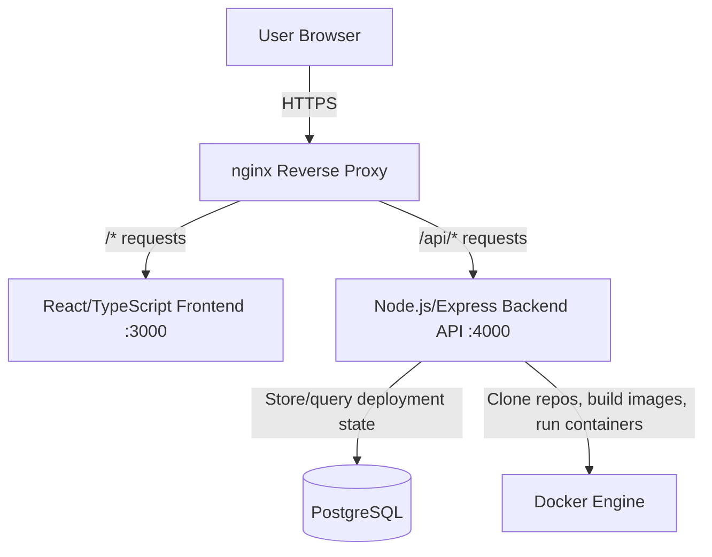

# Deployment Platform

A self-hosted platform that deploys applications from GitHub repositories. Submit a repo URL, and the platform clones it, builds a Docker image, and runs the container — with deployment state tracked in PostgreSQL.

## Architecture

### Components

**nginx** — Reverse proxy sitting in front of both the frontend and backend. Routes `/api/*` to the backend on port 4000 and everything else to the frontend on port 3000. Chosen over Traefik or Caddy for its simplicity in a single-host setup — no service discovery needed.

**React/TypeScript frontend (Vite)** — SPA served on port 3000. Handles the deployment submission form and polls for deployment status updates. Vite over CRA for faster builds and native ESM support. TypeScript for type safety across the API contract.

**Node.js/Express backend** — API server on port 4000. Orchestrates the deployment pipeline: cloning, building, running containers, and persisting state. Express chosen for its minimal surface area — this service doesn't need a framework-heavy approach.

**PostgreSQL** — Stores deployment records: repo URL, build status, container ID, timestamps. Relational model fits the structured nature of deployment state. Chosen over SQLite for concurrent write support under multiple simultaneous deployments.

**Docker Engine** — The backend shells out to Docker to clone repositories, build images from Dockerfiles, and run containers. Each deployment gets its own isolated container. No Kubernetes — this is a single-node platform and the orchestration overhead isn't justified.

## Deployment Flow

What happens when a user submits a GitHub URL:

1. **User submits URL** — The frontend sends the GitHub repository URL via `POST /api/deploy` to the backend.
2. **Backend clones the repo** — The backend pulls the repository into a temporary working directory on the host.
3. **Backend builds a Docker image** — A `docker build` runs against the cloned repo, expecting a Dockerfile at the repo root.
4. **Backend runs the container** — The built image is started as a container with a dynamically assigned port.
5. **Backend persists state** — The deployment record (repo URL, status, container ID, assigned port, timestamps) is written to PostgreSQL.
6. **Frontend polls for status** — The frontend calls `GET /api/deployments` on an interval to reflect the current state of all deployments — queued, building, running, or failed.

## Tech Stack

| Layer | Technology | Purpose |
|-------|-----------|---------|
| Frontend | React, TypeScript, Vite | Deployment UI and status dashboard |
| Backend | Node.js, Express, TypeScript | API server and deployment orchestration |
| Database | PostgreSQL | Deployment state persistence |
| Proxy | nginx | Request routing and static asset serving |
| Runtime | Docker | Container builds and isolation |
